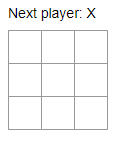
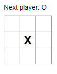
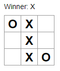

This i a tic-tac-toe game built in React. Here we can practice and larn all the essencial concepts of this library.

  

The project's tutorial is in the oficial React documentation: https://reactjs.org/tutorial/tutorial.html
Have fun! =D